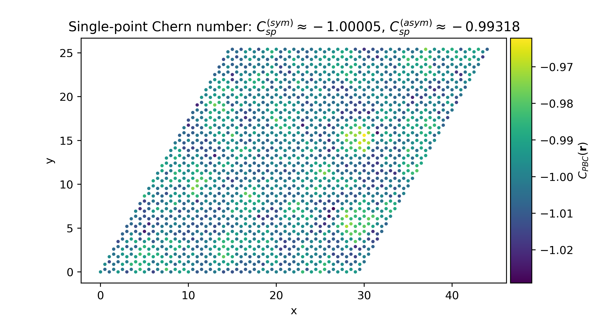

.. StraWBerryPy documentation master file, created by
   sphinx-quickstart on Fri Dec  1 16:44:59 2023.
   You can adapt this file completely to your liking, but it should at least
   contain the root `toctree` directive.

.. role:: python(code)
    :language: python
    :class: highlight

Welcome to StraWBerryPy!
========================

**StraWBerryPy** (Single-poinT and local invaRiAnts for Wannier Berriologies in Python) is a Python package to calculate topological invariants and quantum-geometrical quantities in non-crystalline topological insulators. 

StraWBerryPy can work with periodic and finite systems in tight-binding.
In periodic boundary conditions (PBCs), the code implements the single-point formulas for the Chern number `[Ceresoli-Resta] <https://journals.aps.org/prb/abstract/10.1103/PhysRevB.76.012405>`_ and the single-point spin Chern number `[Favata-Marrazzo] <https://iopscience.iop.org/article/10.1088/2516-1075/acba6f/meta>`_ in the supercell framework. In PBCs, it is also possible to calculate the local Chern marker within periodic boundary conditions `[Baù-Marrazzo](a) <https://doi.org/10.1103/PhysRevB.109.014206>`_, and the local spin-Chern and local :math:`\mathbb{Z}_{2}` markers `[Baù-Marrazzo](b) <https://arxiv.org/abs/2404.04598>`_.
In addition, StraWBerryPy can handle finite systems (such as bounded samples and heterostructures) in open boundary conditions (OBCs) and can compute the local Chern marker `[Bianco-Resta] <https://journals.aps.org/prb/abstract/10.1103/PhysRevB.84.241106>`_, the localization marker `[Marrazzo-Resta] <https://doi.org/10.1103/PhysRevLett.122.166602>`_ , and the local spin-Chern and local :math:`\mathbb{Z}_{2}` markers `[Baù-Marrazzo](b) <https://arxiv.org/abs/2404.04598>`_.

The code provides dedicated interfaces to the tight-binding engines `PythTB <http://www.physics.rutgers.edu/pythtb/>`_ and `TBmodels <https://tbmodels.greschd.ch/en/latest/>`_. Latest version of StraWBerryPy implements the calculation of single-point topological invariants with ab initio Wannier Hamiltonians, which are read in the format produced by `Wannier90 <https://wannier.org/>`_ through `WannierBerri <https://wannier-berri.org/index.html>`_.

Installation
------------
To install StraWBerry you can clone `this <https://github.com/strawberrypy-developers/strawberrypy.git>`_ Github repository and run the following instructions:

.. code:: bash
   
   git clone https://github.com/strawberrypy-developers/strawberrypy.git
   cd strawberrypy
   pip install .

Quick start
-----------

Here, a quick example for calculating the single-point and the local topological invariant in the supercell framework for the Haldane model in presence of Anderson disorder. We can define the periodic model with either :python:`TBmodels` or :python:`PythTB`, which is then passed to the :python:`Supercell` class (when defining the supercell, we also need to specify its dimensions). Then, we can add on-site random disorder and finally call the methods to compute the quantities of interest.

.. code:: python

   import numpy as np
   from strawberrypy import *

   # Define the PBC model
   pbc_model = example_models.haldane_tbmodels(delta = 0.3, t = 1, t2 = 0.15, phi = np.pi / 2)

   # Build the supercell of the model
   model = Supercell(tbmodel = pbc_model, Lx = 30, Ly = 30, spinful = False)

   # Add on-site Anderson disorder
   model.add_onsite_disorder(w = 1.5)

   # Evaluate the single-point Chern number
   sp_inv = model.single_point_chern()
   print("Single-point invariant: {}".format(sp_inv))

   # Evaluate the PBC local Chern marker
   pbclcm = model.pbc_local_chern_marker(macroscopic_average = True, cutoff = 2)

Contents
^^^^^^^^
.. toctree::
   :maxdepth: 1

   tutorial
   strawberrypy
   changelog

Indices and tables
^^^^^^^^^^^^^^^^^^
* :ref:`genindex`
* :ref:`modindex`
* :ref:`search`
* `Github <https://github.com/strawberrypy-developers/strawberrypy>`_