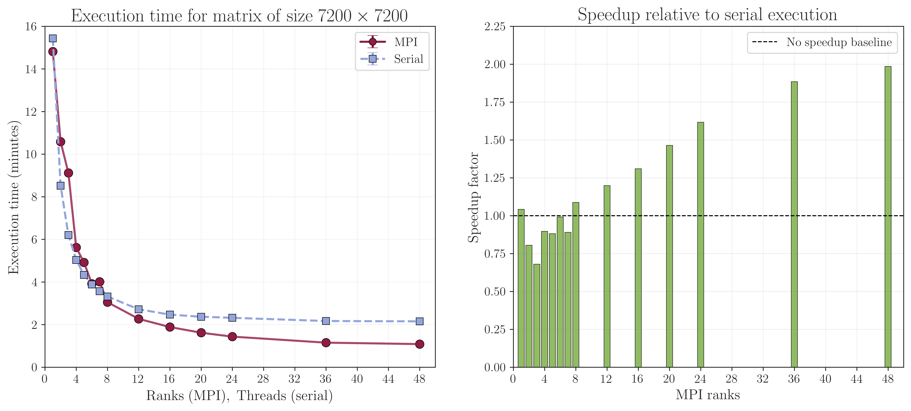
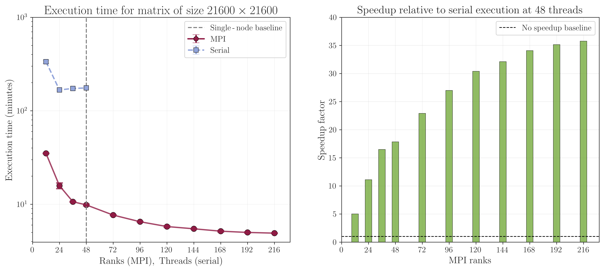

.. role:: python(code)
    :language: python
    :class: highlight

Performance
===========

This section presents the performance benchmarks of StraWBerryPy, demonstrating its scalability and efficiency for large-scale computations. The performance tests include both single-node scaling and multi-node scaling to evaluate the benefits of MPI parallelization in StraWBerryPy compared to the serial version.

Single node scaling tests 
-------------------------
Scaling tests were performed on a single node with Intel(R) Xeon(R) Platinum 8260 CPU @ 2.40GHz (48 total cores) using CINECA `Galileo100 <https://docs.hpc.cineca.it/hpc/galileo.html#system-architecture>`_  HPC cluster. The plots in :numref:`single-node-scaling` displays the execution time for calculating the PBC single-point Chern number for the Haldane model (:math:`L_x =L_y= 60`) with Anderson disorder as a function of the number of CPU cores used. For this system, the matrix has size :math:`7200 \times 7200`. The simulation takes into account eigensolver, linear solver, and matrix multiplication. These operations are performed using ScaLAPACK for distributed memory parallelization of linear algebra routines, and using the ELPA library for parallel eigenvalue computations in the MPI version while NumPy/SciPy native OpenBLAS multithreading in the serial version. 

For a small number of cores (:math:`<8` cores), threads are often faster than MPI ranks since threads share memory inside one process, while MPI ranks behave like separate processes that must communicate explicitly causing communication and startup overhead. However, as the number of CPU cores increases (:math:`\geq 8` cores), the trade-off pays off and the MPI version becomes faster since it scales effectively by distributing the workload across multiple CPU cores and handle larger problem sizes that may not fit into memory when using threads. At 48 cores, is almost twice as fast as the serial version, demonstrating the efficiency of the MPI implementation in StraWBerryPy for large-scale computations.

.. _single-node-scaling:

   Scaling tests for the Haldane model (:math:`L_x =L_y= 60`) with Anderson disorder. The serial version was run so that the number of threads matches the number of CPU cores. Meanwhile, the MPI version was run with the number of ranks matching the number of CPU cores with single-threading. Threading was used for the serial version to maximize performance, while the MPI version was run with single-threading to isolate the performance benefits of MPI parallelization. NumPy and SciPy use multi-threaded OpenBLAS libraries internally, so the actual performance may vary based on the specific configuration and workload.

Multi-node scaling tests 
------------------------
One greatest advantages of the MPI version is that it can be run on multiple nodes, allowing for even greater scalability and performance for larger problem sizes. As demonstrated in :numref:`multi-node-scaling`, the MPI version of StraWBerryPy was tested on a cluster with multiple nodes, each equipped with Intel(R) Xeon(R) Platinum 8260 CPU @ 2.40GHz (48 total cores per node). The plot shows the execution time for calculating the PBC single-point Chern number for the `Kagome model <https://iopscience.iop.org/article/10.1088/0953-8984/23/36/365801>`_ (6 orbitals per unit cell) with supercell size :math:`60\times60` (equivalent to :math:`104 \times 104` supercell size of Haldane Model) with Anderson disorder as a function of the total number of CPU cores used across multiple nodes. This amounts to performing math routines on a :math:`21600 \times 21600` matrix. The results show that as the number of CPU cores increases across multiple nodes, the execution time decreases significantly, demonstrating the strong scaling performance of the MPI version of StraWBerryPy for large-scale computations. On the other hand, the serial version cannot be run on multiple nodes and is limited to the resources of a single node. Furthermore, the serial version saturates with more threads and does not benefit from additional cores due to shared memory bandwidth competition and cache contention among threads, while the MPI version continues to scale effectively across multiple nodes, making it suitable for large-scale simulations that require significant computational resources. For instance, at 216 ranks (4 nodes with 48 cores each + 1 node with 24 cores), the MPI version is almost 36 times faster than the serial version executed at 48 cores in single node. 

.. _multi-node-scaling:

   
   Scaling tests for the Kagome model (:math:`L_x = L_y = 60`) with Anderson disorder across multiple nodes. Same configuration as the single-node tests was used, with the MPI version leveraging distributed memory parallelization across multiple nodes to handle larger problem sizes and achieve faster execution times compared to the serial version. The actual performance may vary based on the specific cluster configuration, network interconnect, and workload characteristics.
