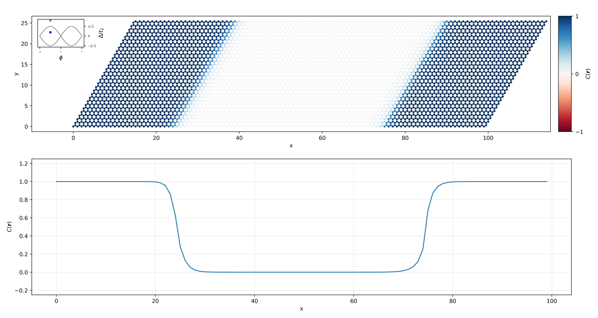

.. role:: python(code)
    :language: python
    :class: highlight

Tutorial and examples
=====================
This page provides a short tutorial on how to use the code. At the end of the page, a couple of examples illustrates some results obtained using the package.

Short tutorial
--------------

Defining a model
^^^^^^^^^^^^^^^^
**StraWBerryPy** is able to read tight-binding model instances from either **PythTB** or **TBmodels**. The creation of the model itself should be performed using those packages (see for instance the relative tutorials for `PythTB <https://www.physics.rutgers.edu/pythtb/examples.html>`_ and `TBmodels <https://tbmodels.greschd.ch/en/latest/tutorial.html>`_). Some useful examples are already implemented in :doc:`example_models<strawberrypy.example_models>`, such as the Haldane and Kane-Mele models.

Once the model has been created, it can be read from StraWBerryPy, which allows to create both finite models and supercells starting from a tight-binding model, using classes :python:`Supercell` and :python:`FiniteModel`, respectively. When creating supercells and finite models, the number of unit cells to be repeated along each direction must be given along with a bool specifying if the model has to be interpreted as spinful or not (needed to properly account for the spin degrees of freedom):

.. code:: python

    import numpy as np
    import strawberrypy
    
    # Import a model from the examples
    uc_model = strawberrypy.example_models.haldane_tbmodels(delta = 0.5, t = 1, t2 = 0.15, phi = np.pi / 2)

    # Create a supercell and a finite model of size L
    supercell_model = strawberrypy.Supercell(tbmodel = uc_model, Lx = L, Ly = L, spinful = False)
    finite_model = strawberrypy.FiniteModel(tbmodel = uc_model, Lx = L, Ly = L, spinful = False)

Adding disorder and vacancies
^^^^^^^^^^^^^^^^^^^^^^^^^^^^^
In order to add disorder and vacancies to a given model we can use the following methods of the classes (available for both supercells and finite models):

.. code:: python

    # Add a random on-site term uniformly distributed in the interval [-W/2, W/2]
    model.add_onsite_disorder(w = 3, seed = rng_seed)

    # Add 15 random vacancies to the lattice
    vacncies = strawberrypy.utils.unique_vacancies(num = 15, Lx = model.Lx, Ly = model.Ly, basis = atoms_uc, seed = rng_seed)
    model.add_vacancies(vacancies_list = vacancies)

.. note::

    The function that adds vacancies in the lattice relies on an internal indexing of the lattice sites inherited from TBmodels and PythTB. Because of this, it may not be accurate with systems not defined using these packages when targeting a specific site.

Calculate the single-point invariant
^^^^^^^^^^^^^^^^^^^^^^^^^^^^^^^^^^^^
If a supercell is created, it is possible to evaluate the single-point invariant by calling the appropriate method. If :python:`spinful == False` the single-point Chern number can be computed using:

.. code:: python

    model.single_point_chern(formula = 'symmetric', return_ham_gap = False)

where :python:`formula` can be :python:`'symmetric'` or :python:`'asymmetric'` (or :python:`'both'`) and specifies whether the single-point invariant should be computed using a formula in which the derivatives are approximated by forward or central finite differences, respectively. The :python:`'symmetric'` formula usually converges faster with the supercell size to the exact result with respect to the :python:`'asymmetric'` one.
The parameter :python:`return_ham_gap` is a bool specifying whether the gap of the Hamiltonian at the :math:`\Gamma`-point in the Brillouin zone should be returned. 

Similarly, if :python:`spinful == True`, the single-point spin Chern number can be computed using:

.. code:: python

    model.single_point_spin_chern(spin = 'up', formula = 'symmetric', return_pszp_gap = False, return_ham_gap = False)

where :python:`spin` can be either :python:`'up'` or :python:`'down'` and indicates which sector of spin projected operator spectra is considered in the calculation of the single-point spin Chern number. 
In fact, the single-point spin Chern number can be computed as :math:`C_s = \frac{1}{2}(C_{\uparrow} - C_{\downarrow})\,\mathrm{mod}2`, where :math:`C_{\uparrow/\downarrow}` are calculated on the eigenstates of spin projected operator with positive/negative eigenvalues; in general it is sufficient to compute either :math:`C_{\uparrow}` or :math:`C_{\downarrow}` only and consider its parity.
The parameter :python:`return_pszp_gap` is a bool specifying whether the gap of the spin projected operator :math:`P S_z P` should be returned. 

The functions :python:`single_point_chern` and :python:`single_point_spin_chern` return a dictionary with labels :python:`'asymmetric'`, :python:`'symmetric'` and, if required, the value of :python:`hamiltonian_gap` (and :python:`pszp_gap` in the single-point spin Chern number function).

Calculate the local topological marker
^^^^^^^^^^^^^^^^^^^^^^^^^^^^^^^^^^^^^^
If a finite model or supercell is created it is possible to evaluate the local topological markers by calling the appropriate method. If :python:`spinful == False` the local Chern marker can be computed using:

.. code:: python

    finite_model.local_chern_marker(direction = None, start = 0, return_projector = False, input_projector = None, macroscopic_average = False, cutoff = 0.8, smearing_temperature = 0.0, fermidirac_cutoff = 0.1)
    supercell.pbc_local_chern_marker(direction = None, start = 0, return_projector = False, input_projector = None, formula = 'symmetric', macroscopic_average = False, cutoff = 0.8, smearing_temperature = 0.0, fermidirac_cutoff = 0.1)

where :python:`direction == None` means that the function returns the topological marker evaluated over the whole lattice. If :python:`direction` is ``0`` or ``1`` the function returns the value of the marker along the *x* or *y* direction respectively starting from :python:`start` (index of the unit cell along the orthogonal direction to :python:`direction`). The parameter :python:`return_projector` is used to return the projectors used in the calculations, namely :math:`\mathcal P` (the ground state projector) in the open boundary conditions case and the list :math:`[\mathcal P_{\Gamma}, \mathcal P_{\mathbf b_1}, \mathcal P_{\mathbf b_2}, \mathcal P_{-\mathbf b_1}, \mathcal P_{-\mathbf b_2}]` in the periodic boundary conditions case. The parameter :python:`input_projector` allows to input the projectors mentioned above (beware of the order) when these are known. The parameters :python:`smearing_temperature` and :python:`fermidirac_cutoff` can be set when dealing with heterostructures to improve the convergence of the topological markers by introducing a Fermi-Dirac occupation function in the calculation of the projectors.

When the system is disordered, it may be useful to return the value of the topological marker averaged over a real-space area bigger than the unit cell of the model. To do so, one can set the parameters :python:`macroscopic_average == True` (useful also when dealing with system that do not respect the internal indexing of PythTB and TBmodels, as mentioned above) and :python:`cutoff` to specify the range of the averages in real space (lattice constant units).

Using StraWBerryPy with Wannier90 output files
^^^^^^^^^^^^^^^^^^^^^^^^^^^^^^^^^^^^^^^^^^^^^^
StraWBerryPy is also able to read *ab initio* tight-binding model instances created through **WannierBerri** given the Wannier functions generated by **Wannier90** code starting from a first-principle calculation. If the *ab initio* calculation is performed in a large enough supercell (:math:`\Gamma`-only calculation), the single-point invariant can be computed.

First, we need to initialize the system through WannierBerri class :python:`System_w90`. For doing this, ``.chk`` and ``.eig`` files from Wannier90 are required. Set :python:`spin = True` if the file ``.spn`` is provided:

.. code:: python

    import wannierberri as wberri

    file_spn = True
    model_wb = wberri.System_w90(seedname = 'wannier90data', spin = file_spn, use_wcc_phase = True)

Then, we need to initialize the model as a :python:`strawberrypy.Supercell`:

.. code:: python

    model = strawberrypy.Supercell(tbmodel = model_wb, Lx = 1, Ly = 1, spinful = True, file_spn = file_spn, n_occ = 1012)

where :python:`file_spn == True` allows to read the spin matrix in the Wannier basis which is used in the calculation of the single-point spin Chern number. Otherwise, the assumption of a tight-binding basis which is diagonal in the spin operator is considered.
The parameter :python:`n_occ` is an integer indicating the number of occupied bands in the ab initio tight-binding model and must be provided.

.. note::
    The number of unit cells to be repeated along each direction must be set to the default value :python:`Lx = 1, Ly = 1` since the *ab initio* system provided as input is already a supercell.

Finally, the single-point spin Chern number can be calculated as shown above:

.. code:: python

    model.single_point_spin_chern()

A couple of examples
--------------------

Topological Anderson insulator in the Kane-Mele model
^^^^^^^^^^^^^^^^^^^^^^^^^^^^^^^^^^^^^^^^^^^^^^^^^^^^^
As an example, we show the detection, through single-point spin Chern number calculation, of a disorder-induced transition in the Kane-Mele model from a trivial phase to a topological Anderson insulating (TAI) one, as investigated in Section 3.2 of Ref. `Favata-Marrazzo (2023) <https://iopscience.iop.org/article/10.1088/2516-1075/acba6f/meta>`_.

.. code:: python

    import numpy as np
    from strawberrypy import *

    # Parameter of the supercell
    L = 24 

    # Define the models in the unit cell
    km_model = example_models.kane_mele_tbmodels(rashba = 1., esite = 5.3, spin_orb = 0.3)

    # Create a supercell L x L
    model = supercell.Supercell(tbmodel = km_model, Lx = L, Ly = L, spinful = True)

    # Compute the single-point spin Chern number for the pristine model
    model.single_point_spin_chern(formula = 'symmetric')

    # Add on-site Anderson disorder 
    model.add_onsite_disorder(w = 4.0, seed = 10)

    # Compute the single-point spin Chern number for the disordered model
    model.single_point_spin_chern(formula = 'symmetric')

Output: ``In the pristine KM model (w = 0): SPSCN = -0.0024642975185114. In the disordered KM model (w = 4): SPSCN = 1.0092772036154``

Topological periodic heterostructure
^^^^^^^^^^^^^^^^^^^^^^^^^^^^^^^^^^^^
As an example, we report here the code used to generate Fig. 3 of Ref. `Baù-Marrazzo (2024a) <https://doi.org/10.1103/PhysRevB.109.014206>`_.

.. code:: python

    import numpy as np
    from strawberrypy import *

    # Parameters of the supercell
    Lx = 100
    Ly = 30

    # Define the models in the unit cell
    model = example_models.haldane_tbmodels(0.3, 1, 0.15, -np.pi / 2)
    model_trivial = example_models.haldane_tbmodels(1.25, 1, 0.15, -np.pi / 2)

    # Create a supercell for both models
    model = Supercell(model, Lx, Ly, spinful = False)
    model_trivial = Supercell(model_trivial, Lx, Ly, spinful = False)
    
    # Substitute model_trivial into model from cell 24 to 74 along the x direction
    model.make_heterostructure(model_trivial, direction = 0, start = 24, stop = 74)

    # Compute the PBC local Chern marker in the whole lattice
    pbclcm_lattice, projectors = model.pbc_local_chern_marker(return_projector = True, smearing_temperature = 0.05, fermidirac_cutoff = 0.1)

    # Compute the PBC local Chern marker along the x direction al half height
    pbclcm_line = model.pbc_local_chern_marker(direction = 0, start = Ly // 2, input_projector = projectors)

