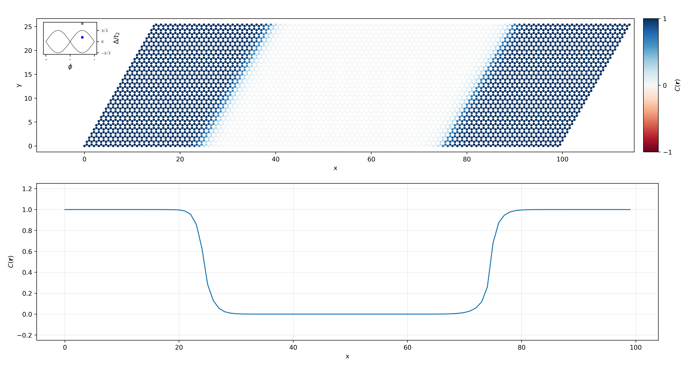

.. role:: python(code)
    :language: python
    :class: highlight

Tutorial and examples
=====================
This page provides a short tutorial on how to use the code. At the end of the page a couple of examples illustrates come results obtained using the package.

Short tutorial
--------------

Defining a model
^^^^^^^^^^^^^^^^
**StraWBerryPy** is able to read model instances from either **PythTB** or **TBmodels**. The creation of the model istelf should be performed using those packages, see for instance the relative tutorials for `PythTB <https://www.physics.rutgers.edu/pythtb/examples.html>`_ and `TBmodels <https://tbmodels.greschd.ch/en/latest/tutorial.html>`_. Some useful examples are already implemented in :doc:`example_models<strawberrypy.example_models>`, such as the Haldane and Kane-Mele model.

Once the model has been created it can be read from StraWBerryPy, which can create both finite models and supercells. Upon creation of supercells and finite models, the number of unit cells repeated along each direction must be given along with a bool specifying if the model has to be interpreted as spinful or not (needed to properly account for the spin degrees of freedom):

.. code:: python

    import numpy as np
    import strawberrypy
    
    # Import a model from the examples
    uc_model = strawberrypy.example_models.haldane_tbmodels(delta = 0.5, t = 1, t2 = 0.15, phi = np.pi / 2)

    # Create a supercell and a finite model of size L
    supercell_model = strawberrypy.Supercell(tbmodel = uc_model, Lx = L, Ly = L, spinful = False)
    finite_model = strawberrypy.FiniteModel(tbmodel = uc_model, Lx = L, Ly = L, spinful = False)

Adding disorder and vacancies
^^^^^^^^^^^^^^^^^^^^^^^^^^^^^
In order to add disorder and vacancies to a given model we can use the methods of the class (available for both supercells and finite models):

.. code:: python

    # Add a random on-site term uniformly distributed in the interval [-W/2, W/2]
    model.add_onsite_disorder(w = 3, seed = rng_seed)

    # Add 15 random vacancies to the lattice
    vacncies = strawberrypy.utils.unique_vacancies(num = 15, Lx = model.Lx, Ly = model.Ly, basis = model.states_uc, seed = rng_seed)
    model.add_vacancies(vacancies_list = vacancies)

.. note::

    The function that adds vacancies in the lattice relies on an internal indexing of the lattice sites inherited from TBmodels and PythTB. Because of this, it may not be accurate with systems not defined using these packages when targeting a specific site.

Calculate the single-point invariant
^^^^^^^^^^^^^^^^^^^^^^^^^^^^^^^^^^^^
If a supercell is created it is possible to evaluate the single-point invariant by calling the appropriate method. If :python:`spinful == False` the single-point Chern number can be computed using:

.. code:: python

    model.single_point_chern(formula = 'symmetric', return_ham_gap = False)

Where ``formula`` can be ``'symmetric'`` or ``'asymetric'`` and specify whether the invariant should be computed with the derivative approximated by forward or central finite differences. The parameter ``return_ham_gap`` is a bool specifying whether the gap of the Hamiltonian should be returned. Similarly, if :python:`spinful == True`, the single-point spin-Chern number can be computed using:

.. code:: python

    model.single_point_spin_chern(spin = 'up', formula = 'symmetric', return_pszp_gap = False, return_ham_gap = False)

Where ``spin`` can be either ``'up'`` or ``'down'`` and specify the sign of the eigenvalues of the projected spin operator on which the topological invariant should be calculated on. The parameter ``return_pszp_gap`` is a bool specifying whether the gap of :math:`PS_zP` should be returned. The functions return a dictionary with labels ``'asymmetric'``, ``'symmetric'``, ``'hamiltonian_gap'`` (and ``'pszp_gap'`` in the single-point spin-Chern number function) depending on the values of the input parameters. 

Calculate the local topological marker
^^^^^^^^^^^^^^^^^^^^^^^^^^^^^^^^^^^^^^
If a finite model or supercell is created it is possible to evaluate the local topological markers by calling the appropriate method. If :python:`spinful == False` the local Chern marker can be computed using:

.. code:: python

    finite_model.local_chern_marker(direction = None, start = 0, return_projector = False, input_projector = None, macroscopic_average = False, cutoff = 0.8, smearing_temperature = 0.0, fermidirac_cutoff = 0.1)
    supercell.pbc_local_chern_marker(direction = None, start = 0, return_projector = False, input_projector = None, formula = 'symmetric', macroscopic_average = False, cutoff = 0.8, smearing_temperature = 0.0, fermidirac_cutoff = 0.1)

Where :python:`direction == None` means that the function returns the topological marker evaluated over the whole lattice. If ``direction`` is ``0`` or ``1`` the functions returns the value of the marker along the *x* or *y* direction respectively starting from ``start`` (index of the unit cell along the orthogonal direction to ``direction``). The parameter ``return_projector`` is used to return the projectors used in the calculations, namely :math:`\mathcal P` (the ground state projector) in the open boundary conditions case and the list :math:`[\mathcal P_{\Gamma}, \mathcal P_{\mathbf b_1}, \mathcal P_{\mathbf b_2}, \mathcal P_{-\mathbf b_1}, \mathcal P_{-\mathbf b_2}]` in the periodic boundary conditions case. The parameter ``input_projector`` allows to input the projectors mentioned above (beware of the order) when these are known. The parameters ``smearing_temperature`` and ``fermidirac_cutoff`` can be set when dealing with heterostructures to improve the convergence of the topological markers by introducing a Fermi-Dirac occupation function in the calculation of the projectors.

When the system is disordered, it may be useful to return the value of the topological marker averaged over a real-space area bigger than the unit cell of the model. To do so, one can set the parameters :python:`macroscopic_average == True` (useful also when dealing with system that do not respect the internal indexing of PythTB and TBmodels, as mentioned above) and ``cutoff`` to specify the range of the averages in real space (lattice constant units).

Using StraWBerryPy with Wannier90 output files
^^^^^^^^^^^^^^^^^^^^^^^^^^^^^^^^^^^^^^^^^^^^^^
?

A couple of examples
--------------------

Strong enough disorder breaks the non-trivial topology
^^^^^^^^^^^^^^^^^^^^^^^^^^^^^^^^^^^^^^^^^^^^^^^^^^^^^^
?

Topological periodic heterostructure
^^^^^^^^^^^^^^^^^^^^^^^^^^^^^^^^^^^^
As an example, we report here the code used to generate Fig. 3 of Ref. `Baù-Marrazzo(2023) <https://arxiv.org/abs/2310.15783>`_.

.. code:: python

    import numpy as np
    from strawberrypy import *

    # Parameters of the supercell
    Lx = 100
    Ly = 30

    # Define the models in the unit cell
    model = example_models.haldane_tbmodels(0.3, 1, 0.15, -np.pi / 2)
    model_trivial = example_models.haldane_tbmodels(1.25, 1, 0.15, -np.pi / 2)

    # Create a supercell for both models
    model = Supercell(model, Lx, Ly, spinful = False)
    model_trivial = Supercell(model_trivial, Lx, Ly, spinful = False)
    
    # Substitute model_trivial into model from cell 24 to 74 along the x direction
    model.make_heterostructure(model_trivial, direction = 0, start = 24, stop = 74)

    # Compute the PBC local Chern marker in the whole lattice
    pbclcm_lattice, projectors = model.pbc_local_chern_marker(return_projector = True, smearing_temperature = 0.05, fermidirac_cutoff = 0.1)

    # Compute the PBC local Chern marker along the x direction al half height
    pbclcm_line = model.pbc_local_chern_marker(direction = 0, start = Ly // 2, input_projector = projectors)

