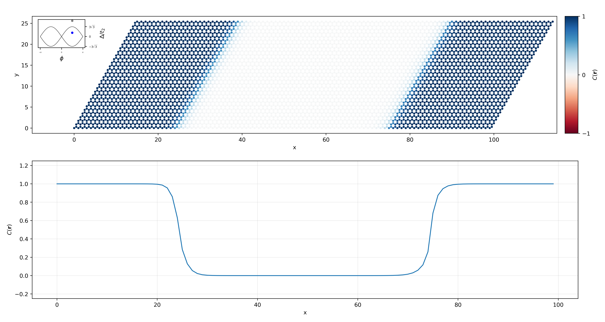

.. role:: python(code)
    :language: python
    :class: highlight

Tutorial and examples
=====================

This page provides a short tutorial on how to use the code. At the end of the page, a couple of examples illustrates some results obtained using the package.

Basic usage
-----------
In this section, we provide a basic tutorial on how to use the code to import a tight-binding model and perform operations on it. For more details, please refer to the :doc:`API documentation<strawberrypy>`.

Defining a model
^^^^^^^^^^^^^^^^
**StraWBerryPy** is able to read tight-binding model instances from either **PythTB** or **TBmodels**. The creation of the model itself should be performed using those packages (see for instance the relative tutorials for `PythTB <https://pythtb.readthedocs.io/en/latest/tutorials.html>`_ and `TBmodels <https://tbmodels.greschd.ch/en/latest/tutorial.html>`_). Some useful examples are already implemented in :doc:`example_models<strawberrypy.example_models>`, such as the Haldane and Kane-Mele models.

Once the model has been created, it can be read from StraWBerryPy, which allows to create both finite models and supercells starting from a tight-binding model, using the methods :meth:`strawberrypy.Model.make_supercell` and :meth:`strawberrypy.Model.make_finite`, respectively. If a model has to be interpreted as spinful, this must be specified with a boolean value upon creation. For instance:

.. code:: python

    import numpy as np
    import strawberrypy
    
    # Import a model from the examples
    uc_model = strawberrypy.example_models.haldane_tbmodels(
            delta = 0.5, t = 1, t2 = 0.15, phi = np.pi / 2
        )

    # Create a supercell of size L x L
    supercell_model = strawberrypy.Model(
            model = uc_model, spinful = False
        ).make_supercell(Lx = L, Ly = L)

    # Create a finite model of size L x L
    finite_model = strawberrypy.Model(
            model = uc_model, spinful = False
        ).make_finite(Lx = L, Ly = L)

In general, half-filling is assumed when creating the model, but it can be changed by passing the parameter :python:`n_occ` to the class or the methods above. For instance, if the model has 4 bands and we want to set the filling to 1/4, we can pass :python:`n_occ = 1` to :python:`Model` or its finite and supercell versions.

Adding disorder and vacancies
^^^^^^^^^^^^^^^^^^^^^^^^^^^^^
In order to add disorder and vacancies to a given model we can use the following methods (available for both supercells and finite models):

.. code:: python

    # Add a random on-site term uniformly distributed in the interval [-W/2, W/2]
    model.add_disorder_uniform(w = 3, seed = rng_seed)

    # Add 15 random vacancies to the lattice
    vacancies = strawberrypy.utils.unique_vacancies(
            num = 16, Lx = model.Lx, Ly = model.Ly,
            basis = atoms_uc, seed = rng_seed
        )
    model.add_vacancies(vacancies_list = vacancies)

.. note::

    The function that adds vacancies in the lattice relies on an internal indexing of the lattice sites inherited from TBmodels and PythTB. Because of this, it may not be accurate with systems not defined using these packages when targeting a specific site.

Calculate the single-point invariant
^^^^^^^^^^^^^^^^^^^^^^^^^^^^^^^^^^^^
If a supercell is created, it is possible to evaluate the single-point invariant by calling the appropriate method. If :python:`spinful == False` the single-point Chern number can be computed using:

.. code:: python

    model.single_point_chern(formula = 'symmetric', return_ham_gap = False)

where :python:`formula` can be :python:`'symmetric'` or :python:`'asymmetric'` (or :python:`'both'`) and specifies whether the single-point invariant should be computed using a formula in which the derivatives are approximated by central or forward finite differences, respectively. The :python:`'symmetric'` formula usually converges faster with the supercell size to the exact result with respect to the :python:`'asymmetric'` one at the cost of being more computationally expensive. The parameter :python:`return_ham_gap` is a bool specifying whether the gap of the Hamiltonian at the :math:`\Gamma`-point in the Brillouin zone should be returned. 

Similarly, if :python:`spinful == True`, the single-point spin Chern number can be computed using:

.. code:: python

    model.single_point_spin_chern(
            spin = 'up', formula = 'symmetric',
            return_pszp_gap = False, return_ham_gap = False
        )

where :python:`spin` can be either :python:`'up'` or :python:`'down'` and indicates which sector of spin projected operator spectra is considered in the calculation of the single-point spin Chern number. In fact, the single-point spin Chern number can be computed as :math:`C_s = \frac{1}{2}(C_{\uparrow} - C_{\downarrow})\,\mathrm{mod}2`, where :math:`C_{\uparrow/\downarrow}` are calculated on the eigenstates of spin projected operator with positive/negative eigenvalues; in general it is sufficient to compute either :math:`C_{\uparrow}` or :math:`C_{\downarrow}` only and consider its parity. The parameter :python:`return_pszp_gap` is a bool specifying whether the gap of the spin projected operator :math:`\mathcal P S_z \mathcal P` should be returned. 

The functions :python:`single_point_chern` and :python:`single_point_spin_chern` return a dictionary with keys :python:`'asymmetric'`, :python:`'symmetric'` and, if required, the value of :python:`hamiltonian_gap` (and :python:`pszp_gap` in the single-point spin Chern number function).

Calculate the local topological marker
^^^^^^^^^^^^^^^^^^^^^^^^^^^^^^^^^^^^^^
If a finite model or supercell is created it is possible to evaluate the local topological markers by calling the appropriate method. If :python:`spinful == False` the local Chern marker can be computed using:

.. code:: python

    finite_model.local_chern_marker(
            direction = None, start = 0, return_projector = False,
            input_projector = None, macroscopic_average = False,
            cutoff = 0.8, smearing_temperature = 0.0, fermidirac_cutoff = 0.1
        )
    supercell.pbc_local_chern_marker(
            direction = None, start = 0, return_projector = False,
            input_projector = None, formula = 'symmetric', macroscopic_average = False,
            cutoff = 0.8, smearing_temperature = 0.0, fermidirac_cutoff = 0.1
        )

where :python:`direction == None` means that the function returns the topological marker evaluated over the whole lattice. If :python:`direction` is ``0`` or ``1`` the function returns the value of the marker along the :math:`\mathbf{a}_1` or :math:`\mathbf{a}_2` direction respectively starting from :python:`start` (index of the unit cell along the orthogonal direction to :python:`direction`). The parameter :python:`return_projector` is used to return the projectors used in the calculations, namely :math:`\mathcal P` (the ground state projector) in the open boundary conditions case and the list :math:`[\mathcal P_{\mathbf b_1}, \mathcal P_{\mathbf b_2}, \mathcal P_{-\mathbf b_1}, \mathcal P_{-\mathbf b_2}, \mathcal P_{\Gamma}]` in the periodic boundary conditions case. The parameter :python:`input_projector` allows to input the projectors mentioned above (thate are interpreted in the same order as above) when these are known. The parameters :python:`smearing_temperature` and :python:`fermidirac_cutoff` can be set when dealing with heterostructures or disordered systems to improve the convergence of the topological markers by introducing a Fermi-Dirac occupation function in the calculation of the projectors.

When the system is disordered, it may be useful to return the value of the topological marker averaged over a real-space area bigger than the unit cell of the model. To do so, one can set the parameters :python:`macroscopic_average == True` (useful also when dealing with system that do not respect the internal indexing of PythTB and TBmodels, as mentioned above) and :python:`cutoff` to specify the range of the averages in real space (lattice constant units). These operations can however be performed also as a post-processing step by using the functions available in the :mod:`strawberrypy.postprocessing <strawberrypy.postprocessing>` module. In this case, by setting :python:`bare_marker = True`, the function returns the local marker without performing any local trace or real-space average, which can be useful to perform custom post-processing operations on clean data.

Using StraWBerryPy with Wannier90 output files
^^^^^^^^^^^^^^^^^^^^^^^^^^^^^^^^^^^^^^^^^^^^^^
StraWBerryPy is also able to read *ab initio* tight-binding model instances through its method :meth:`strawberrypy.Model.from_wannier90` given the Wannier functions generated by the **Wannier90** code starting from a first-principle calculation. If the *ab initio* calculation is performed in a large enough supercell (:math:`\Gamma`-only calculation), the single-point invariant also can be computed. The files required to read the *ab initio* tight binding model depends on the specifi engine used to import the model. Available engines are the following:

- *TBmodels*: see the required files in the `TBmodels tutorial <https://tbmodels.greschd.ch/en/latest/tutorial.html#using-wannier90-output>`_;
- *PythTB*: see the required files in the `PythTB API reference <https://pythtb.readthedocs.io/en/latest/generated/pythtb.W90.html>`_;
- *WannierBerri*: the ``.chk`` and ``.eig`` files produced from Wannier90 are required;

The spin matrices, stored in the ``.spn`` file, can also be read by WannierBerri and used in the calculation of the single-point spin Chern number by passing :python:`spinful = True` (in this case the engine passed is overridden). If the ``.spn`` file is not provided, the code assumes that the tight-binding basis is diagonal in the spin operator. For example, to import with TBmodels a Wannier90 calculation with seedname ``wannier90`` and make a supercell of size :math:`L \times L` out of that, the code is the following:

.. code:: python

    model = strawberrypy.Model.from_wannier90(
        seedname = 'wannier90', path = 'path/to/files',
        engine = 'tbmodels', spinful = False, n_occ = 4
    )
    supercell = model.make_supercell(Lx = L, Ly = L)

The parameter :python:`n_occ` is an integer indicating the number of occupied bands in the *ab initio* tight-binding model and should be provided. If not, the code will try to assume half-filling, but this is not possible in all engines, and is therefore recommended to always provide it.

If the Wannier90 model is already in a supercell but is imported using the class :python:`Model`, a supercell with :python:`Lx = 1, Ly = 1` can be created, allowing the calculation of topological properties in the supercell framework. For example, if :python:`spinful = True`, the single-point spin Chern number can be calculated as above:

.. code:: python

    supercell.single_point_spin_chern()

A couple of examples
--------------------

Topological Anderson insulator in the Kane-Mele model
^^^^^^^^^^^^^^^^^^^^^^^^^^^^^^^^^^^^^^^^^^^^^^^^^^^^^
As an example, we show the detection, through single-point spin Chern number calculation, of a disorder-induced transition in the Kane-Mele model from a trivial phase to a topological Anderson insulating (TAI) one, as investigated in Section 3.2 of Ref. `Favata-Marrazzo (2023) <https://iopscience.iop.org/article/10.1088/2516-1075/acba6f/meta>`_.

.. code:: python

    import numpy as np
    from strawberrypy import *

    # Parameter of the supercell
    L = 24 

    # Define the models in the unit cell
    km_model = example_models.kane_mele_tbmodels(
            rashba = 1., esite = 5.3, spin_orb = 0.3
        )

    # Create a supercell L x L
    model = Model(
            tbmodel = km_model, spinful = True
        ).make_supercell(Lx = L, Ly = L)

    # Compute the single-point spin Chern number for the pristine model
    model.single_point_spin_chern(
            formula = 'symmetric'
        )

    # Add on-site Anderson disorder 
    model.add_onsite_disorder(w = 4.0, seed = 10)

    # Compute the single-point spin Chern number for the disordered model
    model.single_point_spin_chern(formula = 'symmetric')

``Pristine (w = 0): SPSCN = -0.0024642975185114, disordered (w = 4): SPSCN = 1.0092772036154``

Topological periodic heterostructure
^^^^^^^^^^^^^^^^^^^^^^^^^^^^^^^^^^^^
As an example, we report here the code used to generate Fig. 3 of Ref. `Baù-Marrazzo (2024a) <https://doi.org/10.1103/PhysRevB.109.014206>`_.

.. code:: python

    import numpy as np
    from strawberrypy import *

    # Parameters of the supercell
    Lx = 100
    Ly = 30

    # Define the models in the unit cell
    model = example_models.haldane_tbmodels(
            delta = 0.3, t = 1, t2 = 0.15, phi = -np.pi / 2
        )
    model_trivial = example_models.haldane_tbmodels(
            delta = 1.25, t = 1, t2 = 0.15, phi = -np.pi / 2
        )

    # Create a supercell for both models
    model = Model(
            tbmodel = model, spinful = False
        ).make_supercell(Lx = Lx, Ly = Ly)
    model_trivial = Model(
            tbmodel = model_trivial, spinful = False
        ).make_supercell(Lx = Lx, Ly = Ly)

    # Substitute model_trivial into model from cell 24 to 74 along the x direction
    model.make_heterostructure(
            model_trivial, direction = 0, start = 24, stop = 74
        )

    # Compute the PBC local Chern marker in the whole lattice
    pbclcm_lattice, projectors = model.pbc_local_chern_marker(
            return_projector = True, smearing_temperature = 0.05,
            fermidirac_cutoff = 0.1
        )

    # Compute the PBC local Chern marker along the x direction at half height
    pbclcm_line = model.pbc_local_chern_marker(
            direction = 0, start = Ly // 2, input_projector = projectors
        )

Other examples
^^^^^^^^^^^^^^
Additional examples of varying complexity are available in the GitHub repository's `examples <https://github.com/strawberrypy/strawberrypy/tree/main/examples>`_ folder. There, Jupyter notebooks are provided showcasing the post-processing tools, calculation of correlation functions, and the extraction of critical exponents at disorder-induced phase transitions, among other topics.